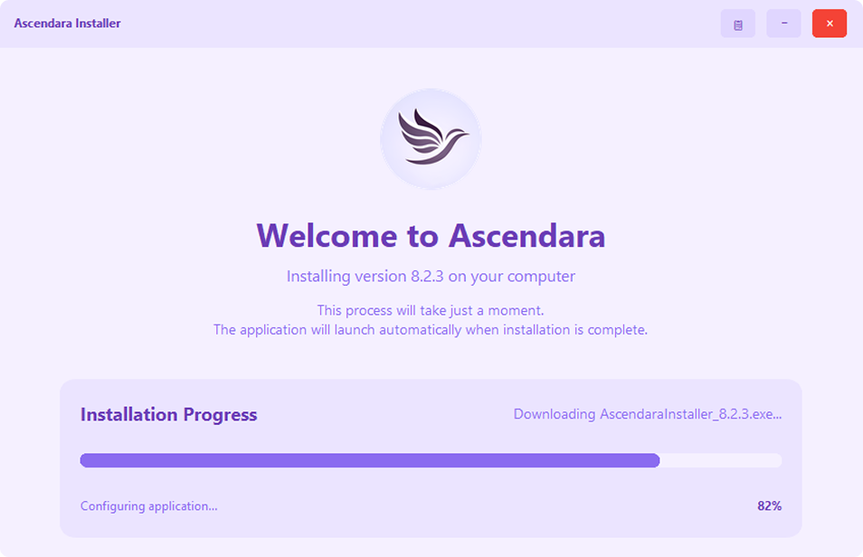

<div align="center">
    
    <h1>Ascendara Installer</h1>
    <p>
        
        <a href="https://ascendara.app/"></a>
        
    </p>
</div>

## 📦 About

The Ascendara Installer provides a modern, user-friendly interface for installing Ascendara on your computer. 
It serves as a wrapper around the core Electron-based installation process, offering a seamless and visually 
appealing experience.

## ✨ Key Features

- Modern and intuitive user interface
- Real-time installation progress tracking
- Automatic download of the latest Ascendara version
- Built-in logging and error handling

## 📸 Preview
<div align="center">
    
</div>


## 🚀 Installation Process

The installer handles the following tasks:
1. Downloads the latest Electron installer package
2. Provides visual feedback during the installation process
3. Manages the core installation through the Electron installer
4. Ensures proper cleanup after installation

## 🔧 Project Structure

The installer is organized into three main components:

- **Core**: Contains the main application logic and installation handlers
- **UI**: Implements the user interface components and visual elements
- **Utils**: Provides utility functions for logging, file operations, and error handling

## 💻 Building From Source

### Prerequisites
- Python 3.8 or higher
- Git (for cloning the repository)

### Setup and Run
1. Clone the repository
   ```
   git clone https://github.com/ascendara/installer.git
   cd installer
   ```

2. Install dependencies
   ```
   pip install -r requirements.txt
   ```

3. Run the application
   ```
   python app.py
   ```

### Building Executable
To build a standalone executable installer:

1. Make sure you have PyInstaller installed
   ```
   pip install pyinstaller
   ```

2. Run the build script
   ```
   build-executable.bat
   ```

This will create an executable in the `dist` folder that can be distributed to users.

## 📝 License & Contact  

This project is part of the Ascendara ecosystem

Licensed under [CC BY-NC 1.0 Universal](./LICENSE) - 2025 tagoWorks

### Get in Touch
- Email: [santiago@tago.works](mailto:santiago@tago.works)
- Website: [tago.works](https://tago.works)
- Discord: [Join our community](https://ascendara.app/discord)

---
<div align="center">
    <sub>Built with 💖 by <a href="https://tago.works">tago</a></sub>
</div>
